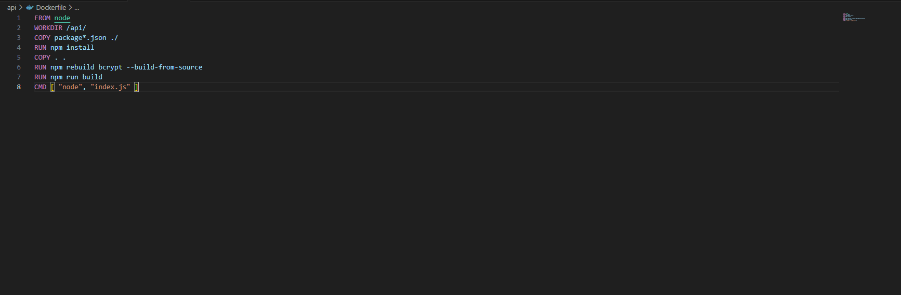
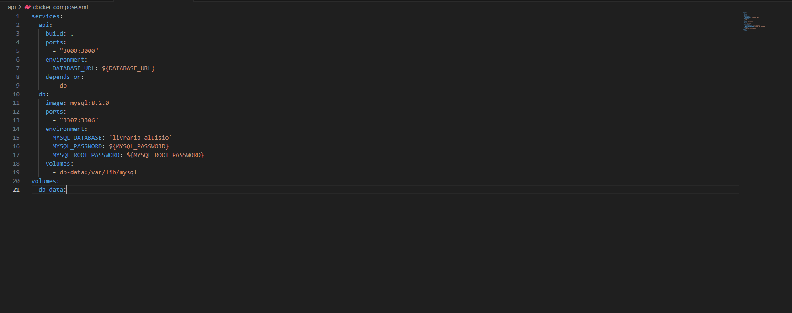

## Descrição

Essa é uma API para uma biblioteca onde um Usuario(funcionario) logado pode fazer o CRUD dos livros é usado
 o Docker File para criação de imagens e utilização do codigo em outras maquinas 

-Os nomes dos integrantes Estão na ultima descrição "Comentários adicionais"

## Tipo de mudança

Marque o que se aplica a este pull request:

- [ ] Bugfix (correção de um problema)
- [ ] Nova funcionalidade (adição de uma nova funcionalidade)
- [ ] Mudança significativa (mudança em uma funcionalidade existente)
- [X] Atualização de documentação

## Como isso foi testado?
Os teste foram feitos localmente para ver as funcionalidades da api e das portas junto com o docker file 
o CRUD foi feito pelo programa Bruno 

## Checklist

Marque todos os pontos que foram verificados:

- [X] Eu testei meu código localmente e ele funciona conforme o esperado
- [ ] Eu adicionei testes que provam que a correção/funcionalidade funciona
- [X] Eu atualizei a documentação conforme necessário
- [ ] Eu fiz o merge das últimas mudanças da branch `main` ou `master` no meu branch

## Issues relacionadas

Liste as issues relacionadas, se houver:

- Resolve # (número da issue)
- Conecta-se a # (número da issue)

## Capturas de tela (se aplicável)

 Print Drocker file 
 Print docker_compose.yml 

#### Comentários adicionais
Trabalho 3# de eng II 
integrantes do Grupo: 
-Rodrigo Gastaud
-Aluisio Pereira
-Dieizon Oliveira
-Matheus Duarte
-Felipe Radmann 